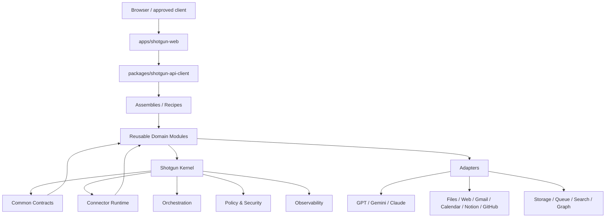

# Shotgun Module Architecture

> 상태: **Architecture Baseline v0.1 + Frontend Amendment**  
> 결정일: 2026-07-16  
> Frontend Amendment 결정일: 2026-07-18  
> 적용 범위: Shotgun 구현 구조, 모듈 계약, Connector Runtime, 오픈소스 배치 원칙, 사용자 Product Surface

Shotgun을 독립적인 기능 모듈과 공통 연결 계약으로 구성하기 위한 아키텍처 문서 모음입니다.

이 문서는 기존 `Knowledge Flow`의 Phase 1~6 의미와 승인 경계를 대체하지 않습니다.  
각 Phase의 책임을 재사용 가능한 모듈에 배치하고, 모듈을 다른 프로젝트에서도 조립해 사용할 수 있도록 구현 경계를 정의합니다.

## 문서

- [Shotgun Module Architecture ADD](./shotgun-module-architecture-add.md)
- [Frontend Product Surface Amendment](./frontend-product-surface-amendment.md)
- [Open-source Role Matrix](./open-source-role-matrix.md)
- [ADR-076 — Modular Monolith First](./adr/ADR-076-modular-monolith-first.md)
- [ADR-077 — Common Contracts and Connector Runtime](./adr/ADR-077-common-contracts-and-connector-runtime.md)
- [ADR-078 — Replaceable Open-source Assignments](./adr/ADR-078-replaceable-open-source-assignments.md)
- [ADR-095 — Frontend Product Surface and Reference Strategy](../adr/ADR-095-frontend-product-surface-and-reference-strategy.md)

## 핵심 결정

1. Shotgun은 **모듈러 모놀리스**로 시작한다.
2. 각 모듈은 명확한 Port, 입력·출력 계약, 데이터 소유권을 가진다.
3. 모듈 간 직접 DB 접근과 공급자 SDK 직접 호출을 금지한다.
4. 공통 Connector Runtime은 Command, Event, Query, Asset Reference를 전달한다.
5. 같은 모듈을 in-process package, worker, 독립 service로 단계적으로 배포할 수 있다.
6. 오픈소스는 시스템 전체에 고정하지 않고 **모듈별 Adapter 뒤에 배치**한다.
7. 오픈소스 배정은 초기 기준선이며 개발 중 benchmark, license, security, maintenance 결과에 따라 변경할 수 있다.
8. Canonical write 권한, 사용자 승인, Claim·Fact 분리, Compiled Truth의 파생 Projection 원칙은 기존 ADD를 그대로 따른다.
9. 최종 사용자 Product Surface는 독립 `shotgun-web`이며 Typed Product Client를 통해 Shotgun Assembly와 연결한다.
10. Frontend는 Principal·Project·Scope·Sensitivity·Approval·Canonical·Action 권위를 소유하지 않는다.
11. `server.ts`의 Inline HTML은 최종 Product UI가 아니라 `Backend Vertical Slice UI`다.

## 전체 구조

## 결정 상태

| 항목 | 상태 |
|---|---|
| 모듈 중심 구조 | Accepted |
| 모듈러 모놀리스 우선 | Accepted |
| 공통 Connector 계약 | Accepted |
| 직접 DB 접근 금지 | Accepted |
| 모듈별 데이터 소유권 | Accepted |
| 독립 `shotgun-web` Product Surface | Accepted |
| Frontend·Server Authority Boundary | Accepted |
| ddsyasas·OpenKnowledge UI 참조 범위 | Accepted |
| 오픈소스 역할 배치 | Baseline Candidate |
| 개별 제품·라이브러리 최종 채택 | Implementation Validation |
| Frontend Framework·Design System | Deferred to technical decision |
| 독립 서비스 분리 시점 | Deferred until measured |

## 변경 원칙

- 새로운 구현 근거가 나오면 기존 배정을 조용히 바꾸지 않는다.
- 변경 이유, 대체 후보, 영향 모듈을 ADR 또는 변경 이력에 남긴다.
- 오픈소스 교체가 Knowledge Flow의 의미와 Canonical 계약을 바꾸지 않도록 Adapter와 Port를 유지한다.
- 라이선스, 보안, 유지보수 상태, 벤치마크를 통과하기 전에는 `Adopted`로 승격하지 않는다.
- Frontend 기술 선택은 `Frontend Product Surface Amendment`와 ADR-095의 서버 권위 경계를 변경할 수 없다.
