# Shotgun Module Architecture ADD

## 0. 문서 관리

- 문서 상태: **Accepted Architecture Baseline v0.1**
- 결정일: 2026-07-16
- 대상 저장소: `JasonCutter/shotgun`
- 적용 범위: 구현 모듈 경계, 공통 계약, Connector Runtime, 배포·재사용 방식
- 기준 문서:
  - `docs/SHOTGUN_KNOWLEDGE_FLOW_BASELINE_v1.0.html`
  - `docs/shotgun_reference_architecture_strategy_ko.html`
  - Phase 1~6 Architecture Design Documents
- 관련 ADR:
  - ADR-076 — Modular Monolith First
  - ADR-077 — Common Contracts and Connector Runtime
  - ADR-078 — Replaceable Open-source Assignments

### 0.1 기존 결정과의 관계

이 문서는 Shotgun Knowledge Flow의 Phase 1~6 순서, Canonical 승인 경계, Claim·Fact 분리, Evidence·Provenance, Compiled Truth 원칙을 변경하지 않는다.

다만 기존 4-레퍼런스 전략에서 `garrytan/gbrain`을 시스템 전체의 기반 엔진으로 강하게 결합하던 구현 방향은 다음과 같이 조정한다.

- Shotgun Kernel과 공통 Contracts가 시스템 전체 경계를 소유한다.
- gbrain은 Runtime, Canonical Knowledge, Search·Graph·Timeline, MCP 영역의 최우선 참고·재사용 후보로 유지한다.
- gbrain을 포함한 어떤 외부 프로젝트도 Shotgun 전체가 직접 의존하는 단일 코어가 되지 않는다.
- 재사용 코드는 모듈 내부 Adapter 또는 Fork Boundary 뒤에 둔다.
- 이 변경은 gbrain의 가치 평가를 낮추는 것이 아니라, 다른 프로젝트에서 모듈을 독립 재사용하기 위한 결합도 조정이다.

## 1. 배경과 문제

Shotgun은 입력, 원본 보존, 변환, Evidence 생성, AI 후보 추출, 검증, 비교, 승인, Canonical 반영, Projection, Discovery, 결과 생성, 외부 Action 실행과 피드백 재진입까지 긴 Knowledge Flow를 가진다.

이 전체 흐름을 하나의 애플리케이션과 데이터 모델로 강하게 결합하면 다음 문제가 생긴다.

- 다른 프로젝트가 입력·변환·검증 등 일부 기능만 재사용하기 어렵다.
- 특정 AI 공급자, 저장소, Queue, 검색 엔진 교체가 전체 시스템 변경으로 번진다.
- 기능별 독립 테스트와 장애 격리가 어렵다.
- 개발 초기에 마이크로서비스로 분리하면 네트워크, 배포, 운영 복잡도가 과도해진다.
- 여러 오픈소스의 좋은 부분을 가져오더라도 각 프로젝트의 런타임과 데이터 모델까지 중첩될 위험이 있다.

따라서 Shotgun은 **논리적으로 독립적인 모듈을 공통 계약으로 연결하되, 초기에는 하나의 배포 단위로 실행하는 구조**를 채택한다.

## 2. 목표

1. 각 모듈을 다른 프로젝트에서 독립적으로 재사용할 수 있게 한다.
2. 모듈을 교체·추가·제거해 Assembly를 구성할 수 있게 한다.
3. 초기 개발은 단순한 모듈러 모놀리스로 유지한다.
4. 무거운 모듈만 Worker 또는 독립 Service로 점진 분리할 수 있게 한다.
5. GPT, Gemini, Claude와 외부 Connector를 Adapter 뒤에 격리한다.
6. Canonical 지식, 승인, History, 외부 Action의 안전 경계를 유지한다.
7. 오픈소스를 모듈 단위로 평가하고 교체할 수 있게 한다.
8. 동일 계약을 in-process, Queue, HTTP/gRPC 환경에서 사용할 수 있게 한다.

## 3. 비목표

- 처음부터 모든 모듈을 별도 마이크로서비스로 배포하지 않는다.
- 모든 프로젝트가 하나의 거대한 공통 Domain Model을 공유하게 만들지 않는다.
- 하나의 만능 Connector 함수로 모든 통신을 처리하지 않는다.
- 오픈소스 프로젝트의 전체 Runtime을 중첩해 실행하지 않는다.
- AI 모델 합의로 Canonical write나 외부 Action 승인을 대체하지 않는다.
- 모듈 독립성을 이유로 Knowledge Flow의 Evidence·승인 단계를 생략하지 않는다.

## 4. 아키텍처 결정 요약

### 4.1 Modular Monolith First

모듈은 독립 package와 논리적 데이터 경계를 갖지만 초기에는 하나의 프로세스 또는 소수 Worker로 배포한다.

분리 기준은 다음과 같은 측정 결과가 있을 때다.

- CPU·메모리·GPU 격리가 필요하다.
- 처리 시간이 길고 비동기 복구가 필요하다.
- 독립 확장·배포 주기가 필요하다.
- 보안·권한 경계를 프로세스 수준으로 분리해야 한다.
- 다른 프로젝트가 독립 서비스로 사용해야 한다.

### 4.2 Contract First

모듈 구현보다 다음 계약을 먼저 안정화한다.

- Message Envelope
- Command
- Event
- Query
- Asset Reference
- Error
- Capability
- Module Manifest
- Security Context
- Provenance Context
- Job·Attempt Context

### 4.3 Port and Adapter

Domain Module은 외부 제품 SDK를 직접 호출하지 않는다.

예:

- AI 모듈은 OpenAI, Gemini, Anthropic SDK를 직접 노출하지 않는다.
- Storage 모듈은 PostgreSQL·S3·Qdrant 구현을 Domain에 노출하지 않는다.
- Action 모듈은 Gmail·Calendar·Notion·GitHub SDK를 Domain에 노출하지 않는다.

외부 구현은 Port를 구현하는 Adapter가 담당한다.

### 4.4 Data Ownership

각 모듈은 자신이 생성하는 상태와 Schema를 소유한다.

초기에는 하나의 PostgreSQL을 공유할 수 있지만 논리 Schema를 분리한다.

```text
runtime.*
intake.*
asset.*
transform.*
evidence.*
candidate.*
validation.*
comparison.*
review.*
canonical.*
projection.*
discovery.*
action.*
feedback.*
audit.*
```

다른 모듈의 Schema를 직접 읽거나 수정하지 않는다. Query Port, Command, Event 또는 Projection을 사용한다.

## 5. 전체 구조

```mermaid
flowchart TB
    subgraph Assembly["Assemblies / Recipes"]
        S1[Shotgun Personal Knowledge OS]
        S2[Research Assistant]
        S3[Document Review System]
        S4[Content Production System]
        S5[Work Automation System]
    end

    subgraph Modules["Reusable Modules"]
        I[Intake]
        A[Original Asset]
        X[Transformation]
        E[Evidence]
        AI[AI Provider]
        C[Candidate Generation]
        V[Validation]
        CC[Comparison & Conflict]
        IM[Impact Analysis]
        CR[ChangeSet & Review]
        CK[Canonical Knowledge]
        PR[Projection]
        KD[Knowledge Discovery]
        OG[Output Generation]
        RP[Risk & Policy]
        AE[Action Execution]
        FR[Feedback & Reentry]
    end

    subgraph Kernel["Shotgun Kernel"]
        CT[Contracts]
        RT[Connector Runtime]
        OR[Job Orchestrator]
        SEC[Security Context]
        OBS[Observability & Audit]
        REG[Module & Capability Registry]
    end

    subgraph Adapters["Adapters"]
        LLM[GPT / Gemini / Claude]
        SRC[File / Web / Drive / Notion / GitHub]
        BUS[In-process / Queue / HTTP / gRPC]
        DB[PostgreSQL / Object Store / Search / Graph]
        ACT[Gmail / Calendar / File / API]
    end

    Assembly --> Modules
    Modules --> Kernel
    Modules --> Adapters
    Kernel --> Adapters
```



## 6. Shotgun Kernel

Kernel은 지식 내용을 판단하지 않는다. 모듈을 등록하고 안전하게 연결하며 실행 상태를 관리한다.

### 6.1 Core Contracts

공통 식별자와 교환 계약을 소유한다.

- `ModuleId`, `ModuleVersion`
- `MessageId`, `CorrelationId`, `CausationId`
- `ProjectId`, `TenantId`, `ActorId`
- `JobId`, `AttemptId`, `BatchId`
- `SourceRef`, `AssetRef`, `EvidenceRef`
- `CandidateRef`, `CanonicalRef`, `ActionRef`
- `SecurityContext`, `ProvenanceContext`
- 공통 오류와 상태 코드

Core Contracts에는 특정 모듈의 비즈니스 로직을 넣지 않는다.

### 6.2 Connector Runtime

다음 네 가지 Port를 제공한다.

| Port | 목적 | 상태 변경 |
|---|---|---|
| Command | 특정 모듈에 작업 요청 | 가능 |
| Event | 발생한 사실을 구독자에게 통지 | 직접 요청하지 않음 |
| Query | 다른 모듈의 공개 읽기 모델 조회 | 불가 |
| Asset | 대용량 원본·파생 파일을 참조로 전달 | 저장소에 따라 가능 |

### 6.3 Job Orchestrator

- Job·Attempt
- Retry·Timeout·Backoff
- Lock·Lease
- Idempotency
- Batch
- Scheduled Job
- Recovery
- Dead-letter
- Cancellation
- Progress

### 6.4 Module Registry

각 모듈의 다음 정보를 등록한다.

- 이름·버전
- 제공 Capability
- 소비 Command·Event
- 발행 Event
- Query Port
- 필요한 권한
- 소유 데이터
- Health Check
- Compatibility Range
- 배포 형태

### 6.5 Policy·Security Context

접근 범위와 민감도는 모든 메시지와 Asset Reference에 포함한다.

Kernel은 다음을 결정적으로 집행한다.

- 권한 확인
- 데이터 최소 전달
- Secret 참조
- Connector 허용 범위
- 승인 토큰
- 민감도 마스킹
- 프로젝트 경계

### 6.6 Observability·Audit

- Trace·Span
- Job·Attempt
- 모델 호출·비용
- Queue 지연
- Retry·Failure
- 승인·거절
- Canonical commit
- 외부 Action
- 데이터 접근
- 모델 불일치

## 7. 공통 Connector 계약

### 7.1 Message Envelope

```json
{
  "message_id": "msg_01",
  "message_type": "DocumentTransformed",
  "schema_version": "1.0",
  "producer": {
    "module": "transformation",
    "version": "0.1.0"
  },
  "correlation_id": "flow_123",
  "causation_id": "cmd_456",
  "project_id": "project_01",
  "actor_id": "user_01",
  "security": {
    "access_scope": ["owner"],
    "sensitivity": "private"
  },
  "provenance": {
    "job_id": "job_01",
    "attempt_id": "attempt_02",
    "policy_version": "policy_03"
  },
  "payload": {},
  "created_at": "2026-07-16T09:00:00+09:00"
}
```

### 7.2 Asset Reference

대형 파일을 메시지 Payload에 반복 포함하지 않는다.

```json
{
  "asset_id": "asset_123",
  "version_id": "version_004",
  "media_type": "application/pdf",
  "content_hash": "sha256:...",
  "size_bytes": 1234567,
  "storage_uri": "asset://asset_123/version_004",
  "security_scope": ["owner"]
}
```

### 7.3 Transport Profile

동일한 Port를 여러 Transport가 구현할 수 있다.

| 단계 | 기본 Transport |
|---|---|
| 단위 테스트 | In-memory |
| 초기 제품 | In-process |
| 무거운 비동기 작업 | Queue Worker |
| 독립 배포 | HTTP 또는 gRPC |
| 외부 통합 | Webhook 또는 MCP |

Domain Module은 사용 중인 Transport를 알지 않는다.

### 7.4 Versioning

- Message type과 Payload schema를 별도로 버전 관리한다.
- 호환 가능한 필드는 추가 방식으로 진화시킨다.
- Breaking change는 새 major schema를 만든다.
- Consumer는 지원하는 version range를 Module Manifest에 선언한다.
- Event를 다시 해석해야 할 때 과거 Event를 덮어쓰지 않고 새 Projection 또는 Migration을 만든다.

### 7.5 오류 모델

공통 오류 범주:

- `VALIDATION_ERROR`
- `POLICY_DENIED`
- `NOT_FOUND`
- `CONFLICT`
- `STALE_VERSION`
- `RETRYABLE_DEPENDENCY`
- `RATE_LIMITED`
- `TIMEOUT`
- `OUTCOME_UNKNOWN`
- `TERMINAL_FAILURE`

오류에는 모듈명, operation, retry 가능성, correlation ID와 안전한 사용자 설명을 포함한다.

## 8. Module Manifest

모듈은 선언형 Manifest를 제공한다.

```yaml
module:
  name: evidence-validator
  version: 0.1.0
  contract_version: 1

deployment:
  modes:
    - in_process
    - worker

consumes:
  commands:
    - ValidateCandidate.v1
  events:
    - CandidateGenerated.v1

produces:
  events:
    - CandidateValidated.v1
    - CandidateRejected.v1

provides:
  queries:
    - GetValidationResult.v1
  capabilities:
    - evidence-alignment
    - visual-grounding

permissions:
  read:
    - evidence
    - source-version
  write:
    - validation-result

health:
  endpoint: /health
```

Manifest는 자동 배선, 호환성 검사, 테스트 Fixture 생성과 Assembly 검증에 사용한다.

## 9. 모듈 카탈로그

모듈 경계는 초기 기준선이다. 구현 중 응집도와 운영 측정에 따라 병합·분할할 수 있지만 Port와 데이터 소유권 변경은 ADR로 기록한다.

### 9.1 Core Infrastructure Modules

| 모듈 | 책임 | 주요 입력 | 주요 출력 |
|---|---|---|---|
| Contracts | 공통 Envelope·ID·Schema | Schema 정의 | SDK·Schema artifact |
| Connector Runtime | Command·Event·Query·Asset 전달 | Message | Delivery result |
| Orchestration | Job·Attempt·Batch·Retry | Command·Schedule | Job event |
| Module Registry | 모듈·Capability 등록 | Manifest | Routing table |
| Policy & Security | 권한·민감도·승인 토큰 | Security context | Permit·Deny |
| Observability & Audit | Trace·비용·감사 | Telemetry event | Metrics·Audit |

### 9.2 Knowledge Flow Modules

| 모듈 | 핵심 책임 | Knowledge Flow |
|---|---|---|
| Intake | 파일·URL·텍스트·Connector 입력 | Phase 1 |
| Original Asset | 원본 불변 저장·버전·Hash·중복 | Phase 1 |
| Transformation | 문서·이미지·오디오를 DocumentIR로 변환 | Phase 2 |
| Evidence | SourceMap·EvidenceSpan·Citation·원문 복귀 | Phase 2 |
| AI Provider | GPT·Gemini·Claude 공통 호출·라우팅 | 전 Phase |
| Candidate Generation | Claim·Entity·Relation·Event·Decision·Action 후보 | Phase 3 |
| Validation | Schema·Evidence·시간·시각·정책 검증 | Phase 2~3 |
| Comparison & Conflict | 중복·충돌·시간·Directive·Priority 비교 | Phase 4 |
| Impact Analysis | Typed edge 기반 직접·재귀 영향 계산 | Phase 4 |
| ChangeSet & Review | Diff·ChangeSet·승인·보류·거절 | Phase 4 |
| Canonical Knowledge | Fact·Claim·Entity·Relation·History 원장 | Phase 5 |
| Projection | Compiled Truth·검색·Graph·Cache | Phase 5 |
| Knowledge Discovery | Gap·새 관계·패턴·행동 후보 | Phase 5 |
| Output Generation | 답변·요약·보고서·콘텐츠·파일 | Phase 6 |
| Risk & Policy | R0~R4·검토·실행 승인 정책 | Phase 6 |
| Action Execution | 승인된 외부 Action 실행·검증·보상 | Phase 6 |
| Feedback & Reentry | 수정·피드백의 Phase별 재진입 | Phase 6 |

## 10. 모듈별 독립성 요구사항

각 재사용 가능 모듈은 최소한 다음을 만족해야 한다.

1. 외부 SDK 없이 Domain Test를 실행할 수 있다.
2. In-memory Adapter를 제공한다.
3. 입력·출력 Schema가 문서화돼 있다.
4. 소유 데이터와 비소유 데이터가 구분돼 있다.
5. 같은 Command의 중복 전달에 안전하다.
6. 실패·Retry·Timeout 의미를 선언한다.
7. Security Context를 받지 못하면 기본적으로 거부한다.
8. Trace와 Job Context를 전달한다.
9. 특정 Assembly 없이도 Contract Test를 통과한다.
10. 다른 구현으로 교체할 수 있는 Port를 가진다.

## 11. AI Provider Module

GPT, Gemini, Claude를 주요 공급자로 폭넓게 활용한다.

### 11.1 제공 Capability

- text generation
- structured output
- vision
- audio understanding
- tool calling
- long context
- embedding
- reranking
- challenger analysis

### 11.2 호출 원칙

Domain Module은 공급자 모델명을 직접 지정하지 않고 Task Profile을 요청한다.

```text
ai.generate_structured(
  task_profile="candidate-extraction",
  schema="ClaimCandidate.v1",
  policy="direct-only",
  data_classification="private"
)
```

AI Provider Module이 capability, 비용, 지연, 데이터 정책과 장애 상태를 기준으로 Adapter를 선택한다.

### 11.3 Provenance

모든 호출은 다음을 기록한다.

- provider·model·version
- prompt·tool·policy version
- 입력 Canonical·Evidence 참조
- 비용·token·latency
- Job·Attempt
- structured output validation
- challenger 결과와 모델 불일치

## 12. Canonical Write 경계

`Canonical Knowledge Module`만 공식 지식 원장에 쓸 수 있다.

다른 모듈은 다음만 할 수 있다.

- 후보 생성
- Validation Result 생성
- Comparison Result 생성
- Draft ChangeSet 생성
- 승인된 Manifest 전달
- Projection 생성

Canonical Module은 승인된 `ApprovedChangeSetManifest`와 precondition을 검증한 후 원자적 commit, revision, HistoryEvent와 outbox를 기록한다.

## 13. Assembly와 Recipe

Assembly는 모듈을 조립한 제품 구성이다.

### 13.1 Shotgun Personal Knowledge OS

모든 Knowledge Flow 모듈을 사용한다.

### 13.2 Research Assistant

```text
Intake
→ Original Asset
→ Transformation
→ Evidence
→ AI Provider
→ Candidate Generation
→ Validation
→ Search Projection
→ Output Generation
```

Canonical 승인과 외부 Action은 선택적으로 포함한다.

### 13.3 Document Review System

```text
Intake
→ Transformation
→ Evidence
→ Validation
→ Comparison & Conflict
→ ChangeSet & Review
```

### 13.4 Content Production System

```text
Canonical Query
→ Output Generation
→ Risk & Policy
→ Export Adapter
→ Feedback & Reentry
```

### 13.5 Work Automation System

```text
Intake
→ Candidate Generation
→ Risk & Policy
→ Action Execution
→ Feedback & Reentry
```

외부 Action은 승인 정책을 반드시 포함한다.

## 14. 배포 진화

### Stage 1 — Package Modular Monolith

- 단일 Repository
- 단일 Application Process
- In-process Connector
- 하나의 PostgreSQL, 분리 Schema
- 독립 package와 Contract Test

### Stage 2 — Worker Separation

다음 모듈을 필요에 따라 Worker로 분리한다.

- Transformation
- AI Provider
- Candidate Generation
- Projection
- Knowledge Discovery
- Action Execution

### Stage 3 — Reusable Services

다른 프로젝트 수요와 운영 측정이 있는 모듈만 독립 Service로 승격한다.

- AI Gateway
- Transformation Service
- Evidence Service
- Action Runtime
- Search·Graph Projection Service

서비스 분리는 목표가 아니라 측정 결과에 따른 선택이다.

## 15. 오픈소스 배치 원칙

오픈소스는 다음 상태로 관리한다.

| 상태 | 의미 |
|---|---|
| Reference | 패턴·UX·테스트 아이디어만 참고 |
| Extract Candidate | 일부 코드를 독립 package로 추출 검토 |
| Adapter Candidate | Port 뒤의 교체 가능한 구현 후보 |
| Foundation Candidate | benchmark 후 기본 구현이 될 수 있음 |
| Adopted | license·security·maintenance·benchmark 통과 |
| Deferred | 필요 시점까지 도입 연기 |
| Rejected | 현재 경계와 충돌하거나 중복이 커서 제외 |

### 15.1 필수 Gate

- License와 Notice 의무
- 보안 취약점과 공급망 위험
- 유지보수 활동
- 테스트 품질
- 데이터 반출·Privacy
- 성능·비용
- API 안정성
- Fork 유지 비용
- 교체 가능성
- Shotgun Canonical 계약과의 정합성

오픈소스 역할은 [Open-source Role Matrix](./open-source-role-matrix.md)에 기록한다.

## 16. 저장소 구조 제안

```text
shotgun/
├─ apps/
│  ├─ web/
│  ├─ api/
│  └─ worker/
├─ packages/
│  ├─ contracts/
│  ├─ module-sdk/
│  ├─ connector-runtime/
│  ├─ orchestration/
│  ├─ policy/
│  ├─ observability/
│  └─ modules/
│     ├─ intake/
│     ├─ asset/
│     ├─ transformation/
│     ├─ evidence/
│     ├─ ai-provider/
│     ├─ candidate/
│     ├─ validation/
│     ├─ comparison/
│     ├─ impact/
│     ├─ review/
│     ├─ canonical/
│     ├─ projection/
│     ├─ discovery/
│     ├─ output/
│     ├─ action/
│     └─ feedback/
├─ adapters/
│  ├─ ai/
│  ├─ storage/
│  ├─ search/
│  ├─ graph/
│  ├─ sources/
│  └─ actions/
├─ assemblies/
│  ├─ shotgun/
│  └─ examples/
└─ docs/
   └─ architecture/
      └─ module-architecture/
```

언어와 build system 확정 전의 논리 구조이며, 실제 workspace 구조는 Bootstrap 단계에서 결정한다.

## 17. 테스트 전략

### 17.1 Contract Test

모든 Adapter가 동일 Port의 행동 규칙을 만족하는지 검증한다.

### 17.2 Module Test

외부 의존성을 In-memory Adapter로 대체해 모듈만 검증한다.

### 17.3 Assembly Test

Recipe가 요구 Capability를 모두 충족하고 순환 의존성이 없는지 확인한다.

### 17.4 Replay Test

Event와 Job 재실행이 같은 논리 결과를 내는지 확인한다.

### 17.5 Failure Test

- 중복 Event
- Queue 지연
- Provider timeout
- 부분 Projection 실패
- stale approval
- Action outcome unknown
- 권한 변경
- Schema version mismatch

## 18. 보안 원칙

- Secret은 메시지 Payload에 포함하지 않는다.
- 모듈은 Secret Reference만 받고 실행 시점에 최소 권한으로 조회한다.
- Security Context가 누락된 요청은 거부한다.
- 모듈 사이에 전달하는 자료는 최소 범위로 제한한다.
- AI Provider에는 필요한 Evidence만 전달한다.
- Action Adapter는 승인된 revision과 parameter digest를 검증한다.
- Audit Event는 수정할 수 없는 저장 경로를 갖는다.
- Cross-project 데이터는 명시적 공유 범위 없이는 조회하지 않는다.

## 19. 주요 Trade-off

### 장점

- 모듈 단위 재사용
- 테스트·교체 용이성
- 외부 공급자 종속 감소
- 점진적 서비스 분리
- 장애·비용 추적
- 다른 프로젝트용 Assembly 생성 가능

### 비용

- 계약·버전 관리 비용
- Eventual Consistency
- Adapter 코드 증가
- 데이터 중복 Projection
- 초기에는 단일 코드베이스보다 파일과 개념이 많아짐
- 경계를 잘못 나누면 분산 모놀리스가 될 수 있음

## 20. 위험과 완화

| 위험 | 완화 |
|---|---|
| 모듈이 지나치게 잘게 분리됨 | 초기에는 논리 모듈로 유지하고 독립 배포를 강제하지 않음 |
| 공통 Contracts가 거대해짐 | Envelope·ID·공통 오류만 공유하고 Domain Payload는 모듈 소유 |
| Event 순환·폭주 | causation chain, depth budget, suppression, idempotency |
| 직접 DB 접근이 생김 | Architecture test와 DB 권한으로 차단 |
| OSS가 모듈 계약을 침범 | Anti-corruption Adapter와 Fork Boundary |
| 공급자 교체 시 의미 변화 | golden corpus, contract test, revision, benchmark |
| 서비스 분리로 운영 복잡도 증가 | 측정된 필요가 있을 때만 분리 |

## 21. 구현 순서

### Milestone 1 — Contract Skeleton

1. `packages/contracts`
2. `packages/module-sdk`
3. `packages/connector-runtime`
4. In-memory Command·Event·Query Bus
5. Module Manifest와 Compatibility Validator
6. OpenTelemetry 기본 Trace

### Milestone 2 — Vertical Slice

다음 최소 흐름을 하나의 Assembly로 구현한다.

```text
File Intake
→ Original Asset
→ Text Transformation
→ Evidence
→ Direct Candidate Extraction
→ Validation
→ Review
→ Canonical Commit
→ Search
→ Answer with Citation
```

### Milestone 3 — Heavy Worker

- AI Provider Worker
- Transformation Worker
- Projection Worker
- Weekly Discovery Job

### Milestone 4 — External Action

- Risk·Approval
- Gmail 또는 Calendar Adapter 한 개
- validate·preview·preflight·execute·verify
- Audit·Feedback Reentry

### Milestone 5 — Reuse Validation

Shotgun 밖의 작은 Example Assembly를 만들어 Intake·Transformation·Evidence 또는 AI Provider 모듈이 독립적으로 재사용되는지 검증한다.

## 22. 완료 기준

- Module Manifest로 모든 모듈이 등록된다.
- In-memory Connector로 vertical slice가 실행된다.
- 모듈 간 직접 DB 접근이 없다.
- AI 공급자 Adapter를 교체해도 Domain Test가 유지된다.
- 최소 한 모듈을 Shotgun 외 Example Assembly에서 재사용한다.
- Event 중복과 Retry가 중복 상태를 만들지 않는다.
- Canonical write는 승인된 Manifest로만 가능하다.
- 외부 Action은 Risk·Approval·Preflight를 우회하지 못한다.
- 오픈소스 교체가 Port와 Contract 안에서 이뤄진다.

## 23. 미결사항·구현 검증 대기

- 주 구현 언어와 monorepo 도구
- in-process Bus 구현
- Queue·Workflow 제품
- Canonical DB와 Graph·Search 제품
- Module Manifest schema 형식
- Plugin sandbox와 서명
- 서비스 분리 기준 수치
- OSS별 license·security·maintenance 검토
- AI Gateway 직접 구현과 LiteLLM 계열 사용 비교
- Temporal·NATS·Redis Streams 등 Runtime 후보 benchmark
- PostgreSQL 단일 저장소와 별도 Search·Graph 제품의 전환 시점

## 24. 변경 이력

### 2026-07-16 — Baseline v0.1

- Shotgun을 재사용 가능한 독립 모듈과 공통 Connector Runtime으로 구성하기로 결정했다.
- 초기 배포는 모듈러 모놀리스로 하고, 필요가 검증된 모듈만 Worker·Service로 분리한다.
- gbrain을 시스템 전체의 단일 코어로 고정하지 않고 모듈별 최우선 재사용 후보로 재배치했다.
- 기존 4개 레퍼런스와 범용 오픈소스의 역할을 모듈 단위로 배정했다.
- 오픈소스 배정은 개발 중 변경 가능한 baseline candidate로 관리한다.
