# Shotgun Module Architecture ADD

## 0. 문서 관리

- 문서 상태: **Accepted Architecture Baseline v0.1**
- 결정일: 2026-07-16
- 대상 저장소: `JasonCutter/shotgun`
- 적용 범위: 구현 모듈 경계, 공통 계약, Connector Runtime, 배포·재사용 방식
- 기준 문서:
  - `docs/SHOTGUN_KNOWLEDGE_FLOW_BASELINE_v1.0.html`
  - `docs/shotgun_reference_architecture_strategy_ko.html`
  - Phase 1~6 Architecture Design Documents
- 관련 ADR:
  - ADR-076 — Modular Monolith First
  - ADR-077 — Common Contracts and Connector Runtime
  - ADR-078 — Replaceable Open-source Assignments

### 0.1 기존 결정과의 관계

이 문서는 Shotgun Knowledge Flow의 Phase 1~6 순서, Canonical 승인 경계, Claim·Fact 분리, Evidence·Provenance, Compiled Truth 원칙을 변경하지 않는다.

다만 기존 4-레퍼런스 전략에서 `garrytan/gbrain`을 시스템 전체의 기반 엔진으로 강하게 결합하던 구현 방향은 다음과 같이 조정한다.

- Shotgun Kernel과 공통 Contracts가 시스템 전체 경계를 소유한다.
- gbrain은 Runtime, Canonical Knowledge, Search·Graph·Timeline, MCP 영역의 최우선 참고·재사용 후보로 유지한다.
- gbrain을 포함한 어떤 외부 프로젝트도 Shotgun 전체가 직접 의존하는 단일 코어가 되지 않는다.
- 재사용 코드는 모듈 내부 Adapter 또는 Fork Boundary 뒤에 둔다.
- 이 변경은 gbrain의 가치 평가를 낮추는 것이 아니라, 다른 프로젝트에서 모듈을 독립 재사용하기 위한 결합도 조정이다.

## 1. 배경과 문제

Shotgun은 입력, 원본 보존, 변환, Evidence 생성, AI 후보 추출, 검증, 비교, 승인, Canonical 반영, Projection, Discovery, 결과 생성, 외부 Action 실행과 피드백 재진입까지 긴 Knowledge Flow를 가진다.

이 전체 흐름을 하나의 애플리케이션과 데이터 모델로 강하게 결합하면 다음 문제가 생긴다.

- 다른 프로젝트가 입력·변환·검증 등 일부 기능만 재사용하기 어렵다.
- 특정 AI 공급자, 저장소, Queue, 검색 엔진 교체가 전체 시스템 변경으로 번진다.
- 기능별 독립 테스트와 장애 격리가 어렵다.
- 개발 초기에 마이크로서비스로 분리하면 네트워크, 배포, 운영 복잡도가 과도해진다.
- 여러 오픈소스의 좋은 부분을 가져오더라도 각 프로젝트의 런타임과 데이터 모델까지 중첩될 위험이 있다.

따라서 Shotgun은 **논리적으로 독립적인 모듈을 공통 계약으로 연결하되, 초기에는 하나의 배포 단위로 실행하는 구조**를 채택한다.

## 2. 목표

1. 각 모듈을 다른 프로젝트에서 독립적으로 재사용할 수 있게 한다.
2. 모듈을 교체·추가·제거해 Assembly를 구성할 수 있게 한다.
3. 초기 개발은 단순한 모듈러 모놀리스로 유지한다.
4. 무거운 모듈만 Worker 또는 독립 Service로 점진 분리할 수 있게 한다.
5. GPT, Gemini, Claude와 외부 Connector를 Adapter 뒤에 격리한다.
6. Canonical 지식, 승인, History, 외부 Action의 안전 경계를 유지한다.
7. 오픈소스를 모듈 단위로 평가하고 교체할 수 있게 한다.
8. 동일 계약을 in-process, Queue, HTTP/gRPC 환경에서 사용할 수 있게 한다.

## 3. 비목표

- 처음부터 모든 모듈을 별도 마이크로서비스로 배포하지 않는다.
- 모든 프로젝트가 하나의 거대한 공통 Domain Model을 공유하게 만들지 않는다.
- 하나의 만능 Connector 함수로 모든 통신을 처리하지 않는다.
- 오픈소스 프로젝트의 전체 Runtime을 중첩해 실행하지 않는다.
- AI 모델 합의로 Canonical write나 외부 Action 승인을 대체하지 않는다.
- 모듈 독립성을 이유로 Knowledge Flow의 Evidence·승인 단계를 생략하지 않는다.

## 4. 아키텍처 결정 요약

### 4.1 Modular Monolith First

모듈은 독립 package와 논리적 데이터 경계를 갖지만 초기에는 하나의 프로세스 또는 소수 Worker로 배포한다.

분리 기준은 다음과 같은 측정 결과가 있을 때다.

- CPU·메모리·GPU 격리가 필요하다.
- 처리 시간이 길고 비동기 복구가 필요하다.
- 독립 확장·배포 주기가 필요하다.
- 보안·권한 경계를 프로세스 수준으로 분리해야 한다.
- 다른 프로젝트가 독립 서비스로 사용해야 한다.

### 4.2 Contract First

모듈 구현보다 다음 계약을 먼저 안정화한다.

- Message Envelope
- Command
- Event
- Query
- Asset Reference
- Error
- Capability
- Module Manifest
- Security Context
- Provenance Context
- Job·Attempt Context

### 4.3 Port and Adapter

Domain Module은 외부 제품 SDK를 직접 호출하지 않는다.

예:

- AI 모듈은 OpenAI, Gemini, Anthropic SDK를 직접 노출하지 않는다.
- Storage 모듈은 PostgreSQL·S3·Qdrant 구현을 Domain에 노출하지 않는다.
- Action 모듈은 Gmail·Calendar·Notion·GitHub SDK를 Domain에 노출하지 않는다.

외부 구현은 Port를 구현하는 Adapter가 담당한다.

### 4.4 Data Ownership

각 모듈은 자신이 생성하는 상태와 Schema를 소유한다.

초기에는 하나의 PostgreSQL을 공유할 수 있지만 논리 Schema를 분리한다.

```text
runtime.*
auth.*
project_admin.*
settings.*
frontend_command.*
intake.*
asset.*
transform.*
evidence.*
candidate.*
validation.*
comparison.*
review.*
canonical.*
projection.*
discovery.*
action.*
feedback.*
audit.*
```

다른 모듈의 Schema를 직접 읽거나 수정하지 않는다. Query Port, Command, Event 또는 Projection을 사용한다.

Authentication은 Principal·Session·Membership·Token을, Project Administration은 Project Identity·Metadata·Lifecycle·Project Revision을, Settings Policy는 Principal Preference·Project/System/Resource Setting·Settings Revision·Policy Context를 소유한다. Frontend Command Gateway는 Browser Command의 accepted context, semantic digest, idempotency, outcome과 recovery ledger를 소유한다.

여러 소유권 경계를 한 번에 갱신해야 하는 Project 생성과 같은 작업은 Assembly의 Application Coordinator 또는 명시적인 Transaction Adapter에서만 수행한다. 이 예외는 해당 Adapter에 다른 Schema의 소유권을 이전하지 않으며, 각 Module Port와 공통 Contract Test를 유지해야 한다.

## 5. 전체 구조

```mermaid
flowchart TB
    subgraph Assembly["Assemblies / Recipes"]
        S1[Shotgun Personal Knowledge OS]
        S2[Research Assistant]
        S3[Document Review System]
        S4[Content Production System]
        S5[Work Automation System]
    end

    subgraph Modules["Reusable Modules"]
        I[Intake]
        A[Original Asset]
        X[Transformation]
        E[Evidence]
        AI[AI Provider]
        C[Candidate Generation]
        V[Validation]
        CC[Comparison & Conflict]
        IM[Impact Analysis]
        CR[ChangeSet & Review]
        CK[Canonical Knowledge]
        PR[Projection]
        KD[Knowledge Discovery]
        OG[Output Generation]
        RP[Risk & Policy]
        AE[Action Execution]
        FR[Feedback & Reentry]
    end

    subgraph Kernel["Shotgun Kernel"]
        CT[Contracts]
        RT[Connector Runtime]
        OR[Job Orchestrator]
        SEC[Security Context]
        OBS[Observability & Audit]
        REG[Module & Capability Registry]
    end

    subgraph Adapters["Adapters"]
        LLM[GPT / Gemini / Claude]
        SRC[File / Web / Drive / Notion / GitHub]
        BUS[In-process / Queue / HTTP / gRPC]
        DB[PostgreSQL / Object Store / Search / Graph]
        ACT[Gmail / Calendar / File / API]
    end

    Assembly --> Modules
    Modules --> Kernel
    Modules --> Adapters
    Adapters --> Kernel
```



## 6. Shotgun Kernel

Kernel은 비즈니스 지식 자체를 처리하지 않는다. 모듈이 안전하고 일관되게 연결되는 기반을 제공한다.

### 6.1 Contracts

- 공통 ID와 resource reference
- Message Envelope
- Command·Event·Query schema
- Asset Reference
- Security·Provenance·Job Context
- error taxonomy
- schema compatibility rule

### 6.2 Connector Runtime

- Command routing
- Event publish·subscribe
- Query dispatch
- Asset Reference resolution
- in-process·Queue·HTTP transport 교체
- idempotency·retry·timeout
- dead-letter·replay
- ordering key

### 6.3 Job Orchestrator

- Job·Attempt·Batch
- Schedule·WeeklyAIBatch
- retry·backoff·timeout
- lock·lease·recovery
- dependency·cancellation
- cost·quota budget

### 6.4 Module Registry

- Module Manifest 등록
- Capability discovery
- version compatibility
- Assembly validation
- health·readiness
- Adapter selection

### 6.5 Policy and Security

- actor·project·access scope
- sensitivity·data classification
- R0~R4 risk policy
- approval token
- data residency·provider policy
- secret reference

### 6.6 Observability and Audit

- trace·metric·structured log
- model·token·cost·latency
- Job·Attempt state
- user review·approval
- Canonical commit
- Action execution
- immutable audit event

## 7. 공통 Connector 계약

### 7.1 Message Envelope

```json
{
  "message_id": "01J...",
  "message_type": "CandidateGenerated",
  "schema_version": "1.0",
  "producer_module": "candidate-generation",
  "producer_version": "0.1.0",
  "correlation_id": "workflow_123",
  "causation_id": "command_456",
  "idempotency_key": "candidate:source-version:profile",
  "project_id": "shotgun",
  "actor": {
    "type": "user",
    "id": "owner"
  },
  "security": {
    "access_scope": ["owner"],
    "sensitivity": "private",
    "data_classification": "personal"
  },
  "provenance": {
    "source_version_ids": ["sv_123"],
    "evidence_ids": ["ev_456"],
    "policy_version": "direct-only.v1"
  },
  "job": {
    "job_id": "job_123",
    "attempt_id": "attempt_2"
  },
  "payload": {},
  "created_at": "2026-07-16T09:00:00+09:00",
  "trace_id": "trace_789"
}
```

### 7.2 Command

Command는 특정 결과를 요청한다.

특성:

- 한 모듈 또는 Capability Handler가 소유한다.
- 요청자는 예상 output contract를 안다.
- 상태 변경이 가능하다.
- idempotency key가 필수다.
- timeout 뒤 결과가 불명확하면 조회 또는 reconcile을 수행한다.

예:

- `RegisterIntakeSubmission.v1`
- `TransformSourceVersion.v1`
- `GenerateCandidates.v1`
- `ValidateCandidateSet.v1`
- `CreateDraftChangeSet.v1`
- `CommitApprovedChangeSet.v1`
- `ExecuteApprovedAction.v1`

### 7.3 Event

Event는 이미 발생한 사실을 알린다.

특성:

- 과거형으로 명명한다.
- 하나 이상의 Consumer가 구독할 수 있다.
- 기본적으로 at-least-once 전달을 허용한다.
- Consumer가 중복을 제거한다.
- 전역 순서를 가정하지 않고 필요한 범위에 ordering key를 사용한다.

예:

- `OriginalAssetStored.v1`
- `DocumentTransformed.v1`
- `CandidateSetValidated.v1`
- `ChangeSetApproved.v1`
- `CanonicalCommitted.v1`
- `ProjectionReady.v1`
- `ActionCompleted.v1`
- `FeedbackSubmitted.v1`

### 7.4 Query

Query는 다른 모듈의 상태나 Projection을 읽는다.

특성:

- 상태를 변경하지 않는다.
- 필요한 최소 read model만 반환한다.
- 내부 table이나 ORM object를 노출하지 않는다.
- access scope를 적용한다.

예:

- `GetSourceVersion.v1`
- `GetEvidenceSpan.v1`
- `SearchCanonicalKnowledge.v1`
- `GetProjectionReadiness.v1`
- `GetActionStatus.v1`

### 7.5 Asset Reference

대형 파일을 Message Payload에 반복 포함하지 않는다.

```json
{
  "asset_id": "asset_123",
  "version_id": "asset-version_4",
  "media_type": "application/pdf",
  "content_hash": "sha256:...",
  "size_bytes": 1200000,
  "storage_uri": "asset://asset_123/asset-version_4",
  "access_scope": ["owner"]
}
```

Asset Resolver가 권한 확인과 signed access를 담당한다.

### 7.6 Transport 추상화

동일한 Port를 여러 Transport가 구현할 수 있다.

| 단계               | 기본 Transport   |
| ------------------ | ---------------- |
| 단위 테스트        | In-memory        |
| 초기 제품          | In-process       |
| 무거운 비동기 작업 | Queue Worker     |
| 독립 배포          | HTTP 또는 gRPC   |
| 외부 통합          | Webhook 또는 MCP |

Domain Module은 사용 중인 Transport를 알지 않는다.

### 7.7 Versioning

- Message type과 Payload schema를 별도로 버전 관리한다.
- 호환 가능한 필드는 추가 방식으로 진화시킨다.
- Breaking change는 새 major schema를 만든다.
- Consumer는 지원하는 version range를 Module Manifest에 선언한다.
- Event를 다시 해석해야 할 때 과거 Event를 덮어쓰지 않고 새 Projection 또는 Migration을 만든다.

### 7.8 오류 모델

공통 오류 범주:

- `VALIDATION_ERROR`
- `POLICY_DENIED`
- `NOT_FOUND`
- `CONFLICT`
- `STALE_VERSION`
- `RETRYABLE_DEPENDENCY`
- `RATE_LIMITED`
- `TIMEOUT`
- `OUTCOME_UNKNOWN`
- `TERMINAL_FAILURE`

오류에는 모듈명, operation, retry 가능성, correlation ID와 안전한 사용자 설명을 포함한다.

## 8. Module Manifest

모듈은 선언형 Manifest를 제공한다.

```yaml
module:
  name: evidence-validator
  version: 0.1.0
  contract_version: 1

compatibility:
  contracts:
    - name: shotgun-contracts
      range: '>=1.0 <2.0'
  runtime:
    range: '>=0.1 <1.0'

deployment:
  modes:
    - in_process
    - worker

data_ownership:
  owns:
    - validation-result
  reads_via_ports:
    - evidence
    - source-version
  direct_schema_access: false

consumes:
  commands:
    - ValidateCandidate.v1
  events:
    - CandidateGenerated.v1

produces:
  events:
    - CandidateValidated.v1
    - CandidateRejected.v1

provides:
  queries:
    - GetValidationResult.v1
  capabilities:
    - evidence-alignment
    - visual-grounding

permissions:
  read:
    - evidence
    - source-version
  write:
    - validation-result

security:
  required_context:
    - actor
    - project
    - access_scope
    - sensitivity
  default_on_missing_context: deny

approval_policy:
  can_create_candidate: true
  can_write_canonical: false
  can_execute_external_action: false
  required_policy_versions:
    - validation-policy.v1

health:
  endpoint: /health
```

Manifest는 자동 배선, 호환성 검사, 테스트 Fixture 생성과 Assembly 검증에 사용한다.

## 9. 모듈 카탈로그

모듈 경계는 초기 기준선이다. 구현 중 응집도와 운영 측정에 따라 병합·분할할 수 있지만 Port와 데이터 소유권 변경은 ADR로 기록한다.

### 9.1 Core Infrastructure Modules

| 모듈                     | 책임                                                                     | 주요 입력                        | 주요 출력                               |
| ------------------------ | ------------------------------------------------------------------------ | -------------------------------- | --------------------------------------- |
| Contracts                | 공통 Envelope·ID·Schema                                                  | Schema 정의                      | SDK·Schema artifact                     |
| Connector Runtime        | Command·Event·Query·Asset 전달                                           | Message                          | Delivery result                         |
| Orchestration            | Job·Attempt·Batch·Retry                                                  | Command·Schedule                 | Job event                               |
| Module Registry          | 모듈·Capability 등록                                                     | Manifest                         | Routing table                           |
| Policy & Security        | 권한·민감도·승인 토큰                                                    | Security context                 | Permit·Deny                             |
| Observability & Audit    | Trace·비용·감사                                                          | Telemetry event                  | Metrics·Audit                           |
| Authentication           | Principal·Session·Membership·Token                                       | 인증·세션 요청                   | 권위 Principal·Session·Membership       |
| Project Administration   | Project Identity·Metadata·Lifecycle·Project Revision                     | Project 관리 Command·Query       | Project Snapshot·Capability             |
| Settings Policy          | Preference·Project/System/Resource Setting·Revision·Policy Context       | 설정 검증·Preview·Apply          | Settings Snapshot·Impact·Policy Context |
| Frontend Command Gateway | Browser Command 검증·Accepted Context·Semantic Digest·Outcome Resolution | Versioned FrontendCommandRequest | FrontendCommandOutcomeView              |

### 9.2 Knowledge Flow Modules

| 모듈                  | 핵심 책임                                                                              | Knowledge Flow |
| --------------------- | -------------------------------------------------------------------------------------- | -------------- |
| Intake                | 파일·URL·텍스트·Connector 입력                                                         | Phase 1        |
| Original Asset        | 원본 불변 저장·버전·Hash·중복                                                          | Phase 1        |
| Transformation        | 문서·이미지를 DocumentIR로 변환하며 영상 URL은 접근 가능한 텍스트 자막·스크립트만 처리 | Phase 2        |
| Evidence              | SourceMap·EvidenceSpan·Citation·원문 복귀                                              | Phase 2        |
| AI Provider           | GPT·Gemini·Claude 공통 호출·라우팅                                                     | 전 Phase       |
| Candidate Generation  | Claim·Entity·Relation·Event·Decision·Action 후보                                       | Phase 3        |
| Validation            | Schema·Evidence·시간·시각·정책 검증                                                    | Phase 2~3      |
| Comparison & Conflict | 중복·충돌·시간·Directive·Priority 비교                                                 | Phase 4        |
| Impact Analysis       | Typed edge 기반 직접·재귀 영향 계산                                                    | Phase 4        |
| ChangeSet & Review    | Diff·ChangeSet·승인·보류·거절                                                          | Phase 4        |
| Canonical Knowledge   | Fact·Claim·Entity·Relation·History 원장                                                | Phase 5        |
| Projection            | Compiled Truth·검색·Graph·Cache                                                        | Phase 5        |
| Knowledge Discovery   | Gap·새 관계·패턴·행동 후보                                                             | Phase 5        |
| Output Generation     | 답변·요약·보고서·콘텐츠·파일                                                           | Phase 6        |
| Risk & Policy         | R0~R4·검토·실행 승인 정책                                                              | Phase 6        |
| Action Execution      | 승인된 외부 Action 실행·검증·보상                                                      | Phase 6        |
| Feedback & Reentry    | 수정·피드백의 Phase별 재진입                                                           | Phase 6        |

## 10. 모듈별 독립성 요구사항

각 재사용 가능 모듈은 최소한 다음을 만족해야 한다.

1. 외부 SDK 없이 Domain Test를 실행할 수 있다.
2. In-memory Adapter를 제공한다.
3. 입력·출력 Schema가 문서화돼 있다.
4. 소유 데이터와 비소유 데이터가 구분돼 있다.
5. 같은 Command의 중복 전달에 안전하다.
6. 실패·Retry·Timeout 의미를 선언한다.
7. Security Context를 받지 못하면 기본적으로 거부한다.
8. Trace와 Job Context를 전달한다.
9. 특정 Assembly 없이도 Contract Test를 통과한다.
10. 다른 구현으로 교체할 수 있는 Port를 가진다.

## 11. AI Provider Module

GPT, Gemini, Claude를 주요 공급자로 폭넓게 활용한다.

### 11.1 제공 Capability

- text generation
- structured output
- vision
- audio understanding _(공통 AI Provider capability 후보이며 Shotgun Assembly에서는 비활성화)_
- tool calling
- long context
- embedding
- reranking
- challenger analysis

Shotgun Personal Knowledge OS Assembly는 Phase 1 Canonical 정책에 따라 오디오·영상 파일 직접 분석, 자동 음성 전사, 영상 프레임·음성·장면 분석 capability를 활성화하지 않는다. 영상 URL은 접근 가능한 제목·설명·자막·스크립트를 텍스트로 확보하는 범위만 지원한다. 다른 Assembly가 이 capability를 사용하려면 별도 범위 결정과 ADR이 필요하다.

### 11.2 호출 원칙

Domain Module은 공급자 모델명을 직접 지정하지 않고 Task Profile을 요청한다.

```text
ai.generate_structured(
  task_profile="candidate-extraction",
  schema="ClaimCandidate.v1",
  policy="direct-only",
  data_classification="private"
)
```

AI Provider Module이 capability, 비용, 지연, 데이터 정책과 장애 상태를 기준으로 Adapter를 선택한다.

### 11.3 Provenance

모든 호출은 다음을 기록한다.

- provider·model·version
- prompt·tool·policy version
- 입력 Canonical·Evidence 참조
- 비용·token·latency
- Job·Attempt
- structured output validation
- challenger 결과와 모델 불일치

## 12. Canonical Write 경계

`Canonical Knowledge Module`만 공식 지식 원장에 쓸 수 있다.

다른 모듈은 다음만 할 수 있다.

- 후보 생성
- Validation Result 생성
- Comparison Result 생성
- Draft ChangeSet 생성
- 승인된 Manifest 전달
- Projection 생성

Canonical Module은 승인된 `ApprovedChangeSetManifest`와 precondition을 검증한 후 원자적 commit, revision, HistoryEvent와 outbox를 기록한다.

## 13. Assembly와 Recipe

Assembly는 모듈을 조립한 제품 구성이다.

### 13.1 Shotgun Personal Knowledge OS

모든 Knowledge Flow 모듈을 사용한다.

### 13.2 Research Assistant

```text
Intake
→ Original Asset
→ Transformation
→ Evidence
→ AI Provider
→ Candidate Generation
→ Validation
→ Search Projection
→ Output Generation
```

Canonical 승인과 외부 Action은 선택적으로 포함한다.

### 13.3 Document Review System

```text
Intake
→ Transformation
→ Evidence
→ Validation
→ Comparison & Conflict
→ ChangeSet & Review
```

### 13.4 Content Production System

```text
Canonical Query
→ Output Generation
→ Risk & Policy
→ Export Adapter
→ Feedback & Reentry
```

### 13.5 Work Automation System

```text
Intake
→ Candidate Generation
→ Validation
→ ActionCandidate
→ Risk Decision
→ Preview
→ User Approval
→ Preflight
→ Action Execution
→ Verify
→ Feedback & Reentry
```

`ActionCandidate` 생성은 실행이 아니다. 외부 쓰기·공개·민감 작업은 검증된 후보, 위험도 판정, 실행 대상과 파라미터가 고정된 Preview, 사용자 승인 토큰과 Preflight를 모두 통과해야 `Action Execution` 상태로 진입한다. Timeout이나 응답 유실로 결과가 불명확하면 자동 재실행하지 않고 `OUTCOME_UNKNOWN`으로 검증한다.

## 14. 배포 진화

### Stage 1 — Package Modular Monolith

- 단일 Repository
- 단일 Application Process
- In-process Connector
- 하나의 PostgreSQL, 분리 Schema
- 독립 package와 Contract Test

### Stage 2 — Worker Separation

다음 모듈을 필요에 따라 Worker로 분리한다.

- Transformation
- AI Provider
- Candidate Generation
- Projection
- Knowledge Discovery
- Action Execution

### Stage 3 — Independent Services

다른 프로젝트에서 독립 사용하거나 격리가 필요한 모듈만 서비스로 분리한다.

후보:

- AI Gateway
- Document Transformation Service
- Evidence Service
- Canonical Knowledge Service
- Action Execution Service

## 15. Module SDK

`shotgun-module-sdk`는 모듈 개발에 필요한 공통 기반을 제공한다.

### 15.1 제공 기능

- Manifest loader와 validator
- Command·Event·Query handler registration
- Message Envelope codec
- Security·Provenance·Job Context
- idempotency middleware
- transaction·outbox helper
- health·readiness
- telemetry instrumentation
- in-memory transport
- contract test kit
- fake clock·fake provider·fake asset store

### 15.2 모듈 패키지 구조 예

```text
modules/evidence/
├─ domain/
├─ application/
├─ ports/
├─ adapters/
├─ contracts/
├─ migrations/
├─ tests/
├─ module.yaml
└─ README.md
```

## 16. Assembly Recipe

Assembly는 필요한 Module과 Adapter를 선언한다.

```yaml
assembly:
  name: shotgun-personal-knowledge-os
  version: 0.1.0

modules:
  - intake
  - original-asset
  - transformation
  - evidence
  - ai-provider
  - candidate-generation
  - validation
  - comparison-conflict
  - impact-analysis
  - changeset-review
  - canonical-knowledge
  - projection
  - knowledge-discovery
  - output-generation
  - risk-policy
  - action-execution
  - feedback-reentry

adapters:
  ai:
    - openai
    - gemini
    - anthropic
  persistence:
    - postgres
  asset_store:
    - local-filesystem
  event_transport:
    - in-process

policies:
  candidate_extraction: direct-only
  canonical_write: explicit-user-approval
  external_action: risk-based-approval
```

Assembly Validator는 다음을 검사한다.

- 필수 Capability가 제공되는가
- Command·Event version이 호환되는가
- Query provider가 하나 이상 존재하는가
- 중복 Canonical writer가 없는가
- Security Context가 연결되는가
- Audit consumer가 존재하는가
- 외부 Action이 승인 경계를 우회하지 않는가

## 17. 권장 저장소 구조

```text
shotgun/
├─ packages/
│  ├─ contracts/
│  ├─ module-sdk/
│  ├─ connector-runtime/
│  ├─ job-runtime/
│  ├─ observability/
│  └─ policy/
│
├─ modules/
│  ├─ intake/
│  ├─ original-asset/
│  ├─ transformation/
│  ├─ evidence/
│  ├─ ai-provider/
│  ├─ candidate-generation/
│  ├─ validation/
│  ├─ comparison-conflict/
│  ├─ impact-analysis/
│  ├─ changeset-review/
│  ├─ canonical-knowledge/
│  ├─ projection/
│  ├─ knowledge-discovery/
│  ├─ output-generation/
│  ├─ risk-policy/
│  ├─ action-execution/
│  └─ feedback-reentry/
│
├─ adapters/
│  ├─ ai-openai/
│  ├─ ai-gemini/
│  ├─ ai-anthropic/
│  ├─ storage-postgres/
│  ├─ asset-local/
│  ├─ search-postgres/
│  ├─ gmail/
│  ├─ calendar/
│  ├─ notion/
│  └─ github/
│
├─ assemblies/
│  ├─ shotgun/
│  ├─ research-assistant/
│  ├─ document-review/
│  └─ work-automation/
│
├─ workflows/
│  ├─ phase-01/
│  ├─ phase-02/
│  ├─ phase-03/
│  ├─ phase-04/
│  ├─ phase-05/
│  └─ phase-06/
│
├─ tests/
│  ├─ contract/
│  ├─ module/
│  ├─ workflow/
│  └─ end-to-end/
│
└─ docs/
```

## 18. 모듈과 Knowledge Flow Phase 매핑

| Phase   | 핵심 모듈                                  | 공통 참여 모듈                    |
| ------- | ------------------------------------------ | --------------------------------- |
| Phase 1 | Intake, Original Asset                     | Contracts, Runtime, Policy, Audit |
| Phase 2 | Transformation, Evidence                   | AI Provider, Validation, Runtime  |
| Phase 3 | Candidate Generation                       | AI Provider, Validation, Evidence |
| Phase 4 | Comparison, Impact, ChangeSet & Review     | Policy, AI Provider, Audit        |
| Phase 5 | Canonical Knowledge, Projection, Discovery | Runtime, Policy, Audit            |
| Phase 6 | Output, Risk, Action, Feedback             | AI Provider, Runtime, Audit       |

Phase는 모듈 디렉터리가 아니다. 여러 모듈을 연결한 Workflow와 Acceptance Test다.

## 19. 재사용과 독립성 검증

각 모듈은 Shotgun Assembly 밖에서 최소 하나의 Test Assembly로 검증한다.

### 19.1 Document Review Test Assembly

```text
Intake + Original Asset + Transformation + Evidence + Validation
```

### 19.2 Research Test Assembly

```text
Intake + Transformation + Evidence + AI Provider + Output
```

### 19.3 Automation Test Assembly

```text
Candidate Generation + Validation + Risk & Policy + Action Execution + Audit
```

검증 항목:

- Shotgun Canonical DB 없이 실행 가능한가
- 외부 SDK를 Fake Adapter로 대체할 수 있는가
- 직접 DB 접근 없이 Contract Test를 통과하는가
- 다른 Assembly 정책을 적용할 수 있는가
- Module package를 별도 release할 수 있는가

## 20. 오픈소스 역할 배정 원칙

상세 배정은 [Open-source Role Matrix](./open-source-role-matrix.md)를 따른다.

핵심 원칙:

1. 오픈소스는 전체 시스템이 아니라 관련 모듈에 배치한다.
2. Domain Port가 OSS API보다 우선한다.
3. 전체 Runtime 중첩 대신 코드 추출·Adapter·패턴 참고를 선호한다.
4. 라이선스·보안·유지보수·Benchmark를 통과하기 전에는 `ADOPTED`로 간주하지 않는다.
5. version·commit을 pin하고 provenance를 남긴다.
6. 교체 시 Contract와 Golden Corpus 결과를 유지한다.
7. 교체 이유와 영향은 ADR로 기록한다.

## 21. 테스트 전략

### 21.1 Contract Test

- schema validation
- backward compatibility
- producer·consumer fixture
- error semantics
- idempotency
- security context propagation

### 21.2 Module Test

- Domain unit test
- in-memory Adapter integration
- failure injection
- retry·timeout
- authorization denial
- duplicate message

### 21.3 Workflow Test

Phase별 시작·종료 Manifest를 실제 모듈로 연결한다.

- Phase 1→2 OriginalAsset handoff
- Phase 2→3 Evidence handoff
- Phase 3→4 Candidate handoff
- Phase 4→5 ApprovedChangeSet handoff
- Phase 5→6 Readiness handoff
- Phase 6→재진입 Feedback handoff

### 21.4 Assembly Test

- 필수 Capability 누락
- version 충돌
- Canonical writer 중복
- 승인 우회
- 접근 범위 손실
- Audit 누락

### 21.5 End-to-End Walking Skeleton

가장 단순한 텍스트 하나가 Phase 1~6을 통과한다.

```text
Text Intake
→ Original Asset
→ Plain Text Transformation
→ EvidenceSpan
→ Direct Claim Candidate
→ Validation
→ Comparison
→ User Approval
→ Canonical Commit
→ Search Projection
→ Cited Answer
```

## 22. 개발 순서

### Stage A — Foundation Walking Skeleton

1. Contracts
2. Module SDK
3. In-process Connector Runtime
4. Job Runtime
5. Security Context
6. Observability
7. Text Intake·Local Asset
8. Plain Text Transformation
9. EvidenceSpan
10. Direct Claim Candidate
11. Validation
12. Simple Comparison·Review
13. Canonical Commit
14. PostgreSQL Search Projection
15. Cited Answer

목표는 각 기반 모듈을 완벽히 만드는 것이 아니라 전체 흐름이 연결되는지 검증하는 것이다.

### Stage B — Phase 1·2 Expansion

- PDF·DOCX·PPTX·XLSX·HTML·Image Adapter
- URL intake
- multimodal visual analysis
- automatic translation
- SourceMap·Composite Evidence

### Stage C — Phase 3·4 Expansion

- Entity·Relation·Event·Decision·Action Candidate
- multi-provider challenger
- Conflict
- Recursive Impact
- DraftChangeSet·BurstDiff
- item-level approval

### Stage D — Phase 5 Expansion

- full Claim·Fact·Entity·Relation schema
- HistoryEvent·Outbox
- Compiled Truth
- Search·Graph Projection
- incremental·weekly Discovery

### Stage E — Phase 6 Expansion

- answer·summary·report·content
- Citation UI
- R0~R4 policy
- external Action preview·approval·execution
- feedback reentry

### Stage F — Module Extraction Validation

- 별도 Test Assembly
- package release
- worker separation benchmark
- independent service decision

## 23. 성공 기준

- 최소 텍스트가 Phase 1~6 전체를 통과한다.
- 모든 모듈이 Module Manifest로 등록된다.
- 다른 모듈 DB에 직접 접근하지 않는다.
- GPT·Gemini·Claude Adapter를 교체할 수 있다.
- 동일 모듈을 다른 Assembly에서 사용할 수 있다.
- Canonical write는 단일 모듈만 수행한다.
- 외부 Action은 승인 경계를 우회하지 않는다.
- Event 중복·Retry·Replay가 멱등하게 처리된다.
- OSS 교체가 Domain 계약을 바꾸지 않는다.
- Module별 비용·성능·오류를 관찰할 수 있다.

## 24. 구현 검증 대기

- 주 언어와 Framework
- Monorepo 도구
- Module Manifest schema 형식
- in-process Bus 구현 방식
- PostgreSQL schema·migration
- Queue·Workflow 선택
- Object Storage 선택
- Search·Graph 제품 선택과 전환 임계값
- LiteLLM 사용 여부
- OPA·Casbin 등 Policy Engine
- Editor·Graph UI framework
- Module package versioning·release
- 독립 Service 분리 조건

## 25. 제외 대안

### 대안 A — Phase별 독립 애플리케이션

각 Phase를 별도 시스템으로 만들면 Phase 내부 기능이 재사용 단위가 되지 않고 공통 모듈이 중복된다.

### 대안 B — 처음부터 Microservices

운영 복잡도, 분산 Transaction, 관찰성과 배포 비용이 MVP 가치보다 크다.

### 대안 C — 단일 Open-source Runtime에 전체 결합

초기 구현은 빠를 수 있지만 Shotgun의 Claim·Fact·Evidence·승인 계약과 다른 프로젝트 재사용성이 외부 Runtime에 종속된다.

### 대안 D — Shared Database Integration

빠르게 연결되지만 데이터 소유권과 변경 경계가 무너진다.

### 대안 E — AI Agent의 자유 오케스트레이션

유연해 보이지만 권한, 재현성, 비용, Canonical write와 외부 Action 승인 경계를 보장하기 어렵다.

## 26. 최종 결정

Shotgun은 **Contract First Modular Monolith**로 구현한다.

- 코드와 책임은 Module 단위로 관리한다.
- 제품 흐름은 Phase Workflow와 Vertical Slice로 검증한다.
- Module은 Port와 Manifest로 조립한다.
- Connector Runtime은 Command, Event, Query, Asset Reference를 전달한다.
- 외부 제품과 오픈소스는 Adapter 뒤에 둔다.
- 개발 초기에는 하나의 배포 단위로 실행한다.
- 측정 근거가 생길 때만 Worker와 Service로 분리한다.
- Canonical, 승인, History, Action의 안전 경계는 기존 ADD를 유지한다.
- 오픈소스 배정은 유연하지만 변경은 ADR과 Benchmark로 추적한다.
