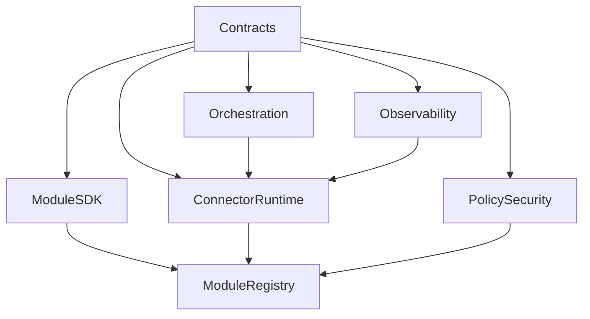
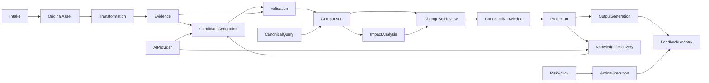

# Shotgun Dependency Map

> 목적: 모듈의 합법적인 의존 방향, 금지 의존성과 Stage별 Critical Path를 정의한다.

## 1. 의존성 원칙

- Domain Module은 Contracts와 자신의 Port에만 직접 의존한다.
- Domain Module은 외부 Provider SDK에 직접 의존하지 않는다.
- 다른 모듈의 저장 Schema를 직접 조회·수정하지 않는다.
- 순환 의존을 금지한다.
- Event Consumer는 Producer의 내부 구현을 알지 않는다.
- 고수준 정책은 저수준 Adapter보다 우선한다.
- Assembly가 모듈을 조립하며 모듈이 Assembly에 의존하지 않는다.

## 2. 계층

```text
Assemblies / Applications
        ↓
Domain Modules
        ↓
Ports and Shared Contracts
        ↓
Kernel Runtime
        ↓
Adapters and Infrastructure
```

허용되는 역방향 호출은 Dependency Inversion을 따른다. Domain이 정의한 Port를 Adapter가 구현한다.

## 3. Core 의존성



### 금지

- Contracts가 특정 Domain Module을 import
- Connector Runtime이 Candidate·Canonical 의미를 해석
- Module Registry가 모듈 DB를 검사
- Observability가 Domain 상태를 수정
- Policy Engine이 AI 응답만으로 Permit을 생성

## 4. Knowledge Flow 의존성



화살표는 코드 import가 아니라 주된 정보 흐름을 나타낸다. 실제 연결은 Port·Command·Event·Query를 사용한다.

## 5. 모듈별 허용 의존성

| 모듈 | 직접 허용 | 간접 또는 Port로만 | 금지 |
|---|---|---|---|
| Intake | Contracts, Intake Port | Original Asset Command | Asset DB 직접 접근 |
| Original Asset | Contracts, Storage Port | Policy Query | Transformation import |
| Transformation | Contracts, Format Ports | Asset Query, Evidence Event | Asset DB·Evidence DB 접근 |
| Evidence | Contracts, Source Resolver Port | Transformation Event | 원본 Storage 직접 접근 |
| AI Provider | Contracts, Provider Ports | Secret Broker, Telemetry | Candidate Domain import |
| Candidate Generation | Contracts, AI·Evidence Ports | Validation Command | Provider SDK 직접 호출 |
| Validation | Contracts, Evidence·Policy Ports | AI Challenger Port | Candidate DB 직접 수정 |
| Comparison | Contracts, Canonical Query Port | Directive·Priority Query | Canonical DB 접근 |
| Impact Analysis | Contracts, Graph Query Port | Projection Query | 자유 AI Edge를 공식 Edge로 저장 |
| ChangeSet & Review | Contracts, Comparison·Impact Result | Approval Policy | Canonical DB 직접 Commit |
| Canonical Knowledge | Contracts, Persistence Port | Approved Manifest | Candidate DB 직접 읽기 |
| Projection | Contracts, Canonical Event·Query | Search·Graph Adapter | Canonical 원장 수정 |
| Discovery | Contracts, Projection·AI Ports | Candidate Reentry Command | Canonical 직접 Write |
| Output Generation | Contracts, Retrieval·AI Ports | File Export Adapter | Canonical 수정 |
| Risk & Policy | Contracts, Policy Store Port | Context Queries | Provider SDK·Connector 실행 |
| Action Execution | Contracts, Connector Ports | Approval·Policy Query | Candidate 생략·직접 실행 |
| Feedback & Reentry | Contracts, Routing Policy | Phase별 Command | Fact·Directive 자동 저장 |

## 6. 데이터 소유권

| Schema 영역 | 소유 모듈 | 다른 모듈 접근 방식 |
|---|---|---|
| `runtime.*` | Orchestration | Job Query·Event |
| `intake.*` | Intake | Intake Query |
| `asset.*` | Original Asset | Asset Resolver·Source Query |
| `transform.*` | Transformation | Transformation Query·Event |
| `evidence.*` | Evidence | Evidence Query·Citation Lookup |
| `candidate.*` | Candidate Generation | Candidate Query·Manifest |
| `validation.*` | Validation | Validation Query·Event |
| `comparison.*` | Comparison | Comparison Result Query |
| `impact.*` | Impact Analysis | Impact Projection Query |
| `review.*` | ChangeSet & Review | Review Query·Approved Manifest |
| `canonical.*` | Canonical Knowledge | Canonical Query·Commit Event |
| `projection.*` | Projection | Search·Graph·Compiled Truth Query |
| `discovery.*` | Knowledge Discovery | Discovery Manifest·Activity Query |
| `action.*` | Action Execution | Action Status Query·Result Event |
| `feedback.*` | Feedback & Reentry | Feedback Query·Reentry Event |
| `audit.*` | Audit | Read-only Audit Query |

하나의 PostgreSQL을 사용하더라도 DB Role과 Schema Permission으로 직접 접근을 제한한다.

## 7. Event 의존성

### Phase 1~2

```text
IntakeAccepted
→ OriginalAssetStored
→ TransformationRequested
→ DocumentTransformed
→ EvidenceAvailable
```

### Phase 3~4

```text
EvidenceAvailable
→ CandidateGenerationRequested
→ CandidateGenerated
→ CandidateValidated
→ ComparisonCompleted
→ DraftChangeSetReady
→ ReviewDecisionRecorded
```

### Phase 5

```text
ChangeSetApproved
→ CanonicalCommitted
→ ProjectionRequested
→ ProjectionReady or ProjectionDegraded
→ DiscoveryRequested
```

### Phase 6

```text
OutputGenerated
→ FeedbackSubmitted
→ ReentryRequested

ActionCandidateValidated
→ ActionRiskDecided
→ ActionPreviewReady
→ ActionApproved
→ ActionPreflightPassed
→ ActionExecuted
→ ActionVerified or ActionOutcomeUnknown
```

Event 이름은 예시다. 정확한 이름과 Schema는 Contracts 구현에서 버전화한다.

## 8. Critical Path

### Walking Skeleton Critical Path

1. Contracts
2. Module SDK·Registry
3. Connector Runtime
4. Security·Observability 최소 기능
5. Intake
6. Original Asset
7. Transformation Plain Text
8. Evidence Text Selector
9. AI Provider
10. Claim Candidate
11. Validation
12. Comparison
13. ChangeSet & Review
14. Canonical Knowledge
15. Search·Citation Projection
16. Output Generation

Critical Path 외 기능은 병렬 Prototype이 가능하지만 Product Integration을 차단하면 안 된다.

## 9. 병렬 개발 가능 영역

Stage 1 이후 다음은 병렬 진행할 수 있다.

- Intake UI와 Original Asset Storage Adapter
- Plain Text Transformation과 Evidence Selector 설계
- Provider Adapter와 Fake AI Adapter
- Minimal Review UI와 Comparison Domain
- Canonical Schema Prototype과 Transactional Outbox Spike
- PostgreSQL Search Projection Prototype

단, 공통 Contract가 고정되기 전에는 Branch 또는 Prototype으로 유지하고 Main Integration을 서두르지 않는다.

## 10. 기술 결정 차단점

| 결정 | 늦어도 필요한 시점 | 차단 범위 |
|---|---|---|
| 주 언어·Framework | Stage 0 | 전체 코드 기반 |
| Monorepo 도구 | Stage 0 | Package·CI |
| Schema 기술 | Stage 1 | 모든 Contract |
| PostgreSQL Version·ORM | Stage 2 | Persistence·Migration |
| Object Storage 방식 | Stage 2 | Original Asset |
| 첫 AI Provider | Stage 4 | Candidate Generation |
| Review UI Framework | Stage 5 | Review Product Gate |
| Search MVP 방식 | Stage 7 | Cited Search |
| Graph Store | Stage 10 이전 | Impact·Graph Projection |
| 첫 Action Connector | Stage 11 | External Action Slice |

기술 제품 선택은 Architecture 불변 원칙보다 낮은 수준이다. 제품이 바뀌어도 Port를 유지한다.

## 11. 순환 방지

### 허용되는 논리적 재진입

Knowledge Discovery에서 Candidate Generation으로 돌아가는 흐름은 순환 코드 의존성이 아니라 `DiscoveryReentryManifest`를 통한 새 Workflow다.

Feedback에서 이전 Phase로 돌아가는 흐름도 새 Command와 Correlation ID를 생성한다.

### 필수 제어

- Reentry Depth
- Semantic Signature
- Snapshot ID
- Cost·Time Budget
- Suppression Record
- 사용자 보류·거절 기록

## 12. Architecture Test 규칙

최소 다음 규칙을 자동 검사한다.

- `modules/*`가 다른 `modules/*/infrastructure`를 import하지 않음
- `modules/*`가 Provider SDK Package를 import하지 않음
- `adapters/*`가 Domain 내부 비공개 타입을 사용하지 않음
- `contracts`가 Domain·Adapter를 import하지 않음
- `canonical` 외 모듈이 Canonical Persistence Port의 Write Interface를 사용하지 않음
- `action-execution` 외 모듈이 External Connector Execute Port를 사용하지 않음
- Assembly만 Concrete Adapter를 조립함

## 13. 의존성 변경 승인

다음 변경은 ADR 또는 명시적 Architecture Review가 필요하다.

- 모듈 데이터 소유권 이전
- 새로운 모듈 간 동기 의존 추가
- 직접 DB 조회 예외
- Connector 전달 보장 변경
- Canonical Write 권한 변경
- Action Execute 권한 변경
- 공통 Contract Major Version
- 독립 Service 분리와 네트워크 경계 추가
